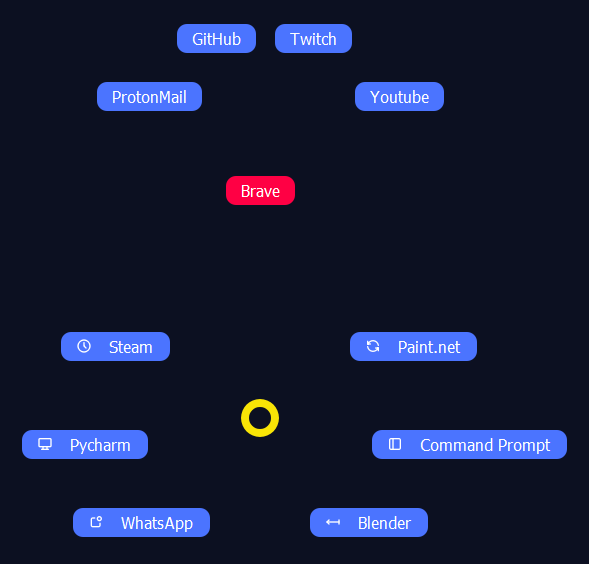

# Pie Menus Expanded

PME is an expanded version of the original Pie Menu project. PME adds pie menus to Windows (and eventually Linux)
inspired by the 3D modeling software Blender, with many more features that aren't found in the original 'Pie Menus'
project.

### What can PME do?

With PME, you can create pie menus containing different slices. Each slice can then have functionality attached to it.
I.e. inputting some keystrokes, starting up a program, or even running a script. Besides that, you can also add hotkeys
with the same types of functionality.

Each of these pie menus and hotkeys is saved in a profile, linked to a certain program. The selected profile changes
based on which program on your computer is focussed on. If you select Chrome, the profile linked to Chrome will be
selected if available, otherwise the default profile is loaded. This allows for pie menus and hotkeys that are created
for very specific purposes.

There are several more features that haven't been mentioned so far, like:

* General piemenus and hotkeys, that will load regardless of which profile is selected - unless overridden by the
  selected profile. This allows for general pie menus and hotkeys, that, for instance, open up commonly used programs or
  run functionality you might need at any time.
* Sub slices. These are a second level of slices within a pie menu. These are handy for extra functionality related to
  the main slice. For instance, if you have a slice dedicated to opening Chrome, the sub slices can be dedicated to
  opening frequently used websites.

  

### How do I use PME?

For now, the source code itself will have to be run, because the build is behind on the newer features. The build will
get updated eventually. The first iteration of the settings menu has been implemented recently, so you don't have to
mess with the JSON config yourself anymore. In there, you can set up pie menus and hotkeys for each profile. Right-click
the taskbar icon, and select the settings menu to change your settings.

When the project is finished, a detailed video tutorial will be released. This could be done already, but it seems
wasteful to put all that effort in when the project and its features are still constantly changing.

#### How do I create a new profile for a certain program?

In the default profile a hotkey is set up for this. Change the input to whatever key works for you. Then simply press
said key after opening/selecting the program you want a new profile to be generated for.

### What features will be added in the future?

A detailed list of future plans can be found
in <a href="https://www.evernote.com/shard/s583/sh/74aa1ffb-5e7b-41d0-3762-3f2410a39443/b2b79d21c2e839aa473cd698f93c5b7d">
this notebook</a>. The main features planned, however, are:

* A rework of the settings menu, to be more aesthetic and user-friendly.
* Menu scripts. These are scripts that can dynamically alter the names and functionality of slices of pie menus.
  Continuing with the Chrome example, instead of manually filling in all of your most frequently used websites, you
  could write a custom script that tracks your internet usage and constantly updates the slices to reflect your most
  frequented websites, as they change over time.
* A major overhaul of the theme settings, allowing for the creation of custom skins, to make every pie menu look exactly
  like how you want them to look.
* Pie menu groups. These would be pie menus linked to the same hotkey, that can be scrolled through, using either
  certain hotkeys or the scroll wheel.
* A Linux port of the project.
